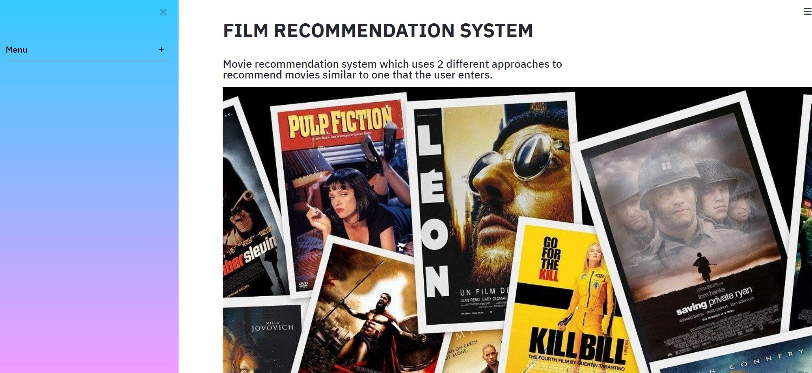

# Movie-Recommender-System
A recommender system is an application that takes in the name of a certain movie, book, tv show, song, etc. and using certain mathematical/machine learning based algorithms to find similar titles.

These titles are then suggested to the user. Different algorithms have been used in this particular application, to recommend movies similar to the input provided by the user.

# Algorithms used for recommendations
Here, the movies are recommended using 2 different approaches:
1. Nearest Neighbors clustering algorithm clusters titles based on ratings given by users with similar preferences. The similarity metric uses a neighbor's (another customer's) preferences as recommendations for the current customer if their tastes are similar.
2. Content based recommendations identify a user's preferences based on details about the movie like its genre, plot description, cast/crew and director.

# Information regarding recommendations

How does collaborative filtering work?

A large dataset consisting of different movies and reviews from other customers, is used as a reference for predicting what other movies the given user might enjoy watching.
The algorithm used here is based on unsupervised clustering of movies according to their cosine similarities. The few most similar movies are picked out by the model. This uses the fact that if 2 persons enjoy watching one movie, one of them might like the variety of movies watched by the other.

How does content based filtering work?

Any dataset with different movies, their genres, cast, etc. is present and recommendations are picked by the algorithm based on the value of similarity between the user's input and the description of pre-existing movies in the database.

An image of the working Streamlit app:

Image of algorithm's recommendations for the movie Thor:

# Some drawbacks
Collaborative filtering doesn't make expected or personalized recommendations. It doesn't have any clue as to what genre the movie belongs to or why the user likes that particular movie. It merely follows prescribed mathematical guidelines to establish and print recommendations.

Content based filtering requires us to input only those movies that are already present in the database. It requires the exact title with spaces, punctuations and proper spelling. If the movie is unavailable, it doesn't display recommendations.
